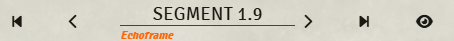
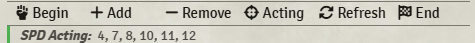
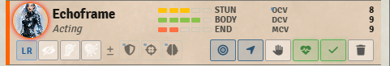

# HERO Combat Engine

An unofficial Foundry VTT v11 combat-tracker module for HERO System that replaces Foundry's default tracker, which is incompatible with HERO's phase/segment model. It adds a floating controller panel per-scene that streamlines key elements of the HERO system.

 > HERO System is a trademark of HERO Games. This module is not affiliated with or endorsed by HERO Games.
I'm just a huge fan. 🤙

## Quick Start
Assumes familiarity with Foundry and/or Forge VTT.

1. Download and enable the module in your HERO Systems world. Latest stable release: `https://raw.githubusercontent.com/evj90/hero-combat-engine/main/module.json`
2. Set the scene for action and adventure with tokens placed.
3. Open the HERO Combat panel from the scene controls. The button loads after the scene is complete, so it may take a few seconds to appear.
4. Click **Begin** to build the combat order from the selected tokens.
5. Use segment navigation, token panels, active effects display, and modifier controls to fight for justice.
6. See Configure Settings to explore options.

## What It Does

- Adds a floating tracker to cycle through combat order with configurable highlights.
- Displays configurable pip-style stat tracking 
- Manages quick conditions, active effects, and combat state directly from the panel.
- Replaces Foundry's linear initiative with HERO's 12-segment phase/segment combat flow.
- Supports HERO actions including Hold, Release Hold, Abort, segment stepping, and post-Segment 12 recovery.

## Why the Foundry Built-In Tracker Doesn't Quite Work Here

- No concept of segments, phases, or the SPD chart.
- Assumes linear initiative ordered by die roll.
- No support for Hold, Release Hold, or Abort in the turn model.
- No segment-aware token highlighting, stat pip bars, or per-combatant combat value tracking.

## Requirements

- Foundry Virtual Tabletop v11. This is where it started. Input is welcome.
- A HERO System world or actor data model that exposes HERO-style characteristics such as SPD, DEX, STUN, BODY, END, OCV, DCV, and MCV

### Manual / Direct Download

Download a ZIP and unpack it into your Foundry `Data/modules/` folder (the unpacked folder must be named `hero-combat-engine`).

| Branch | Download |
|--------|----------|
| `main` | `https://github.com/evj90/hero-combat-engine/archive/refs/heads/main.zip` |
| `develop` | `https://github.com/evj90/hero-combat-engine/archive/refs/heads/develop.zip` |

## Installation

### Foundry VTT (self-hosted)

1. Open **Configuration → Module Management → Install Module**.
2. Paste a manifest URL from the table below into the **Manifest URL** field and click **Install**.

| Branch | Purpose | Manifest URL |
|--------|---------|--------------|
| `main` | Stable releases | `https://raw.githubusercontent.com/evj90/hero-combat-engine/main/module.json` |
| `develop` | Latest in-progress work | `https://raw.githubusercontent.com/evj90/hero-combat-engine/develop/module.json` |

### The Forge

1. Log in and open your game's **Module Management** page from the Forge dashboard.
2. Click **Install Module (from Manifest URL)**.
3. Paste the manifest URL for the branch you want and confirm.

| Branch | Purpose | Manifest URL |
|--------|---------|--------------|
| `main` | Stable releases | `https://raw.githubusercontent.com/evj90/hero-combat-engine/main/module.json` |
| `develop` | Latest in-progress work | `https://raw.githubusercontent.com/evj90/hero-combat-engine/develop/module.json` |

## Panel Workflow

### Top Navigation

- **Previous Segment / Next Segment** steps backward or forward through HERO timing.
- **Previous Token / Next Token** moves within the current segment's acting order.
- **Hide Non-Acting** toggles a filtered view so only relevant tokens remain visible.

### GM Controls

- **Begin** starts a combat from selected tokens.
- **Add** adds currently selected tokens to the active combat.
- **Remove** removes currently selected tokens from the active combat.
- **Acting** re-highlights the currently acting token.
- **Refresh** rebuilds and re-sorts combat order using current stats.
- **End** clears combat state and shuts the encounter down.

### Per-Combatant Controls

- **Ping** and **Pan** jump the table to a token quickly.
- **DCV Bonus** cycles DCV bonus stages, with right-click direct set (right-click indicators shown as blue dots).
- **OCV Bonus** cycles OCV bonus stages, with right-click direct set (right-click indicators shown as blue dots).
- **MCV Bonus** cycles MCV bonus stages, with right-click direct set (right-click indicators shown as blue dots).
- **Drain / Aid badges** track active adjustments with right-click management (right-click indicators shown as blue dots).
- **Hold** removes a token from its current place so it can act later in the segment.
- **Release Hold** inserts that held token immediately after the current acting token.
- **Abort** marks a token as aborting before it acts.
- **Recovery** takes recovery and ends the token's turn (highlighted as primary action).
- **Done** ends the token's turn normally (highlighted as primary action).
- **Remove from Combat** removes that token from the encounter.

### Stat and Value Display

- Pip bars for tracked characteristics (default STUN, BODY, and END; add any other).
- Combat value rows are configurable (default OCV, DCV, MCV; add any other)).
- Temporary combat value modifiers can target any configured combat-value stat.
- Color-coded thresholds for Full, Less, Half, Hurt, Risk, and Out states.
- Accessibility sizing options for larger text and hit areas.

### Status and Adjustment Tools

- Quick status toggles for Flashed (Sight), Flashed (Hearing), and Entangled/Restrained.
- Other non-quick active effects displayed when active.
- OCV/DCV/MCV bonus tracking with one-click cycle changes.
- Drain and Aid badges tracked from the panel.
- Entangle BODY tracking when present on the token.

## Settings Highlights

Many configurations are available. The settings menu covers four main areas:

- **Tracker behavior**: auto-open for players, auto-close on combat end, SPD column visibility, tracked pip characteristics with live preview, combat value characteristics with live preview, hide non-acting tokens, and accessibility sizing.
- **Turn management**: player turn-ending permissions, skip warnings (including held-token loss warnings), automatic empty-segment skipping, incapacitated-token skipping, and DEX tie-break behavior.
- **Visuals**: active highlight colors, incapacitated colors, burst settings, ring width, inset, glow radius, and glow intensity.
- **Recovery and chat output**: token turn messages, segment summaries, skipped segment notices, post-segment 12 recovery messages, and configurable STUN/BODY recovery thresholds.

## Usage Notes

- Using the built-in Foundry tracker with the HERO System can cause freezing. Using this with built-in tracker definitely won't help, and may result in the same freezing.
- Combat state is stored with the scene. Each scene can have zero or one combats. Multiple scenes can have simultaneous combats. 
- Depending on hosting, the toolbar button image can appear a few seconds after page load. On The Forge, CDN asset loading can delay that icon on first load.

## Contributing

Interested in improving the HERO Combat Engine? Contributors are welcome!

- **[Contributing Guide](CONTRIBUTING.md)** — How to submit bugs, features, and pull requests
- **[Development Guide](DEVELOPMENT.md)** — How to set up your development environment
- **[Issues](https://github.com/evj90/hero-combat-engine/issues)** — Report bugs or suggest features
- **License** — This project is licensed under MIT

## Version

Current module version: `1.1.0`

