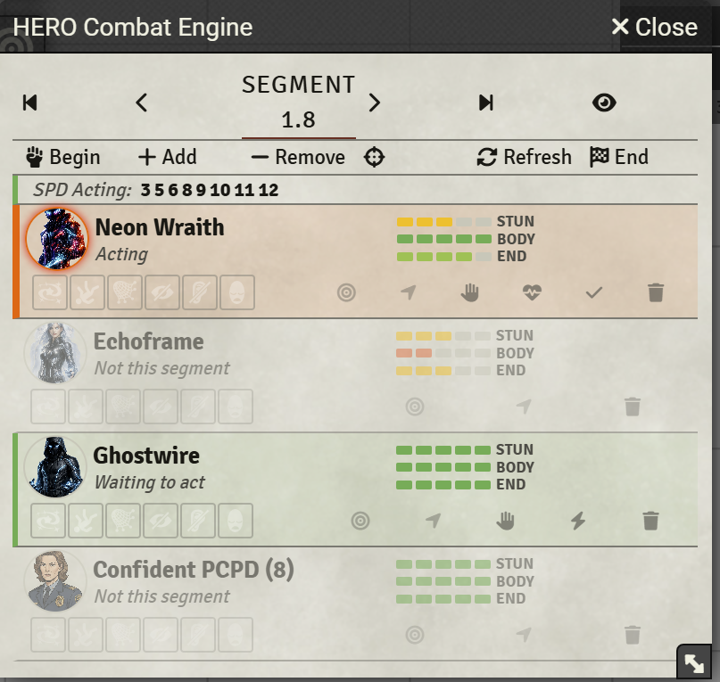
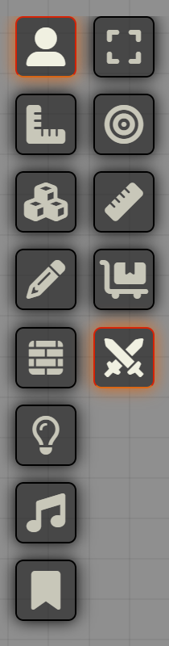

# HERO Combat Engine

An unofficial Foundry VTT v11 module for HERO System segment/phase combat. Runs entirely on scene flags — no Foundry Combat documents required.

> HERO System is a trademark of HERO Games. This module is not affiliated with or endorsed by HERO Games.

## Features

<table><tr><td valign="top">

- **Segment/phase flow** — 12-segment, multi-phase timing driven by HERO SPD charts
- **Combat panel** — floating tracker sorted by DEX; shows every combatant's turn state each segment
- **Stat bars** — colour-coded pip bars for STUN, BODY, END, and optional PRE; colours and thresholds configurable
- **Quick status toggles** — per-row buttons for Stunned, Prone, Restrained, Blind, Deaf, Unconscious
- **Hold & Release** — token can declare Hold; released tokens are inserted immediately after the current actor for that segment only
- **Abort** — tokens can declare Abort; badge shown on their row
- **Highlights** — PIXI starburst burst on segment advance (all clients); pulsing AmbientLight glow on the acting token (colour shifts when incapacitated)
- **Post-Segment 12 recovery** — eligibility reported in chat based on configurable STUN/BODY thresholds
- **Macros** — bundled compendium of GM macros (begin combat, advance segment, highlight acting token)

</td><td valign="top">

</td></tr></table>

## Settings

| Group | Setting | Default |
|---|---|---|
| **Tracker** | Show SPD column | on |
| | Show PRE bar | off |
| | Auto-open panel for players on combat start | on |
| | Auto-close panel on combat end | on |
| | Hide non-acting tokens (per-client toggle) | off |
| **Turn management** | Players can advance any token's turn | off |
| | Warn before skipping acting tokens | off |
| | DEX tie-break stat (END or EGO) | END |
| **Stat bars** | Full / Less / Half / Hurt threshold % | 100 / 75 / 50 / 25 |
| | Colour per condition (Full to Out) | green to grey |
| **Highlights** | Active / Incapacitated glow colour | green / red |
| | Burst colour, stroke width, ring inset, duration | yellow / 4 / 15 / 3000ms |
| | Glow bright radius, dim radius, intensity | 0 / 5 / 0.6 |
| **Chat** | Token turn messages | on |
| | Segment advance summary | on |
| | Post-Segment 12 recovery messages | on |
| **Recovery thresholds** | BODY dead/dying | <= 0 |
| | STUN every-phase / post-12 only / once-a-minute | >= -10 / -20 / -30 |

## Usage

1. Select tokens and click **Begin** in the panel to start combat (sorted by DEX).
2. Step through turns with the chevron buttons or the **Done / Recovery** buttons on each row.
3. Use the segment forward/back buttons to advance or rewind segments.
4. Click **End** to clear all combat state and close the panel on all clients.

## Note

<table><tr><td valign="top">

The module toolbar button may take a moment to appear after the page loads. On The Forge, module assets are served from a CDN with lazy loading — the button image is fetched independently from the page and can lag behind by a few seconds on first load.

</td><td valign="top">

</td></tr></table>

